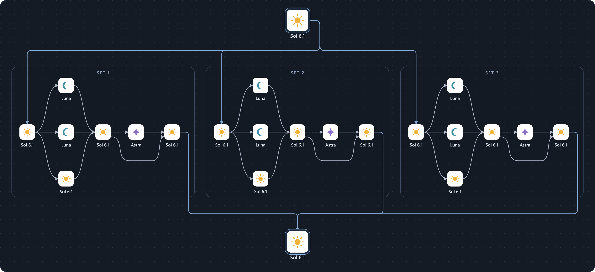

# 6.1 Sol Orch · 3 SET Fast

**A Codex skill for three independent work packages, coordinated by one Sol chief that owns final integration and verification.**

The chief assigns objectives, research questions and file ownership before execution. Each SET explores, researches and implements within its own scope. **Every model role requires Fast mode.**

[한국어](README.md) · [Skill instructions](skills/6-1-sol-orch-3set-fast/SKILL.md) · [Example plan](examples/plan.json) · [Apache-2.0](LICENSE)



The large Sol cards at the top and bottom represent **the same chief at dispatch and integration**. Repeated Sol cards inside a SET are stages of the same leader. Dashed edges enter optional Astra review; the lower curve bypasses review when it is unnecessary.

[Editable SVG](skills/6-1-sol-orch-3set-fast/assets/topology.svg). The sun, crescent and star are original explanatory symbols, not official model logos. This is the target topology, not a trace of a fully concurrent run.

## Why use this skill?

| Strength | How the workflow supports it |
| --- | --- |
| Less duplicated work | A chief-owned plan gives every SET exclusive questions, work keys, write scopes and outputs before dispatch. |
| Three independent work streams | Package boundaries and shared input contracts let ready work proceed concurrently; dependencies wait for accepted evidence. |
| Clear responsibility | The chief owns global decisions and integration. SET leaders own local execution. Cross-SET reassignment requires acknowledged handoff. |
| Fast required throughout | Chief, leaders, Luna, Sol workers and Astra all require Fast. Unsupported roles are not silently sent through Standard. |
| Bounded review and capacity | Astra is conditional. Global slot grants keep waiting leaders from consuming all worker capacity. |

These are design properties. The project does not establish a threefold speedup, a token-saving percentage, or guaranteed elimination of all collisions.

## Compared with the original one-SET skill

| Aspect | [6-1-sol-orch](https://github.com/Kimhyuntae9665/codex-skill-6-1-sol-orch) | 3 SET Fast |
| --- | --- | --- |
| Coordination | One Sol owns decomposition and integration | One chief plus up to three SET leaders |
| Work unit | Individual delegated tasks | SET work packages containing bounded tasks |
| Ownership checks | Scoped contracts and single-writer guidance | Same principles plus global plan and checker |
| Service tier | No skill-level Fast requirement | Fast required for every role |
| Best fit | A task worth bounded delegation | Several substantial, independent packages |

## Models and roles

| Role | Model | Reasoning | Service tier |
| --- | --- | --- | --- |
| Chief | `gpt-6.1-sol` | medium | Fast required |
| SET leader | `gpt-6.1-sol` | medium | Fast required |
| Explorer | `gpt-6-luna` | high | Fast required |
| Researcher | `gpt-6-luna` | high | Fast required |
| Implementation worker | `gpt-6.1-sol` | high | Fast required |
| Conditional reviewer | `gpt-6-astra` | low | Fast required |

A SET has at most one live child per role. Unneeded roles stay unused. Leaders cannot recursively create another three SETs. Small tasks remain with the chief.

## Install

Ask a Codex GitHub skill installer:

```text
Install the Codex skill at:
https://github.com/Kimhyuntae9665/codex-skill-6-1-sol-orch-3set-fast/tree/main/skills/6-1-sol-orch-3set-fast
```

Or clone and copy it into the documented user skill directory, `~/.agents/skills`. Verify the search path used by your client and avoid duplicate installations.

**Windows PowerShell**

```powershell
git clone https://github.com/Kimhyuntae9665/codex-skill-6-1-sol-orch-3set-fast.git
if ($LASTEXITCODE -ne 0) { throw 'Git clone failed.' }
$skillTarget = Join-Path $HOME '.agents/skills/6-1-sol-orch-3set-fast'
if (Test-Path -LiteralPath $skillTarget) { throw 'Skill already exists. Back it up before updating.' }
New-Item -ItemType Directory -Path (Split-Path $skillTarget) -Force | Out-Null
Copy-Item -LiteralPath './codex-skill-6-1-sol-orch-3set-fast/skills/6-1-sol-orch-3set-fast' -Destination $skillTarget -Recurse
```

**macOS / Linux**

```sh
(
  set -eu
  git clone https://github.com/Kimhyuntae9665/codex-skill-6-1-sol-orch-3set-fast.git
  skill_target="$HOME/.agents/skills/6-1-sol-orch-3set-fast"
  if [ -e "$skill_target" ]; then
    echo 'Skill already exists. Back it up before updating.' >&2
    exit 1
  fi
  mkdir -p "$HOME/.agents/skills"
  cp -R ./codex-skill-6-1-sol-orch-3set-fast/skills/6-1-sol-orch-3set-fast "$skill_target"
)
```

For project-only use, copy into the project's `.agents/skills/6-1-sol-orch-3set-fast` directory instead. Installation copies a workflow; it does not change runtime settings.

## Use

Select Sol 6.1 / medium and Fast in the host. Check child model availability and nested delegation support. Invoking a skill cannot switch an active chief model.

```text
$6-1-sol-orch-3set-fast
Build the account API, UI and user guide.
Have the chief freeze the shared schema first. Assign API files to SET1,
UI files to SET2 and guide files to SET3. Check duplicate work keys and
file ownership before dispatch, then verify the integrated result.
```

```text
$6-1-sol-orch-3set-fast
Research these 12 companies in three disjoint pools of four.
Give each company/question one research owner and a shared evidence format.
Have the chief define the rubric and compare all results in a final report.
```

## Check a dispatch plan

The helper uses only Python 3.9+ standard-library modules. From the repository root:

```sh
python skills/6-1-sol-orch-3set-fast/scripts/check_plan.py examples/plan.json --workspace .
```

Exit `0` means the declared plan passed; `2` means it failed. Checks include overlapping paths, duplicate work keys, unowned outputs and dependency cycles. Shared reads are allowed. The helper validates declared SET ownership; semantic duplication and actual agent edits still need review. It is not an OS file lock.

## Runtime limits and evidence

| Total slots, including chief | Scheduling |
| --- | --- |
| 13+ | Chief + three leaders + up to three workers per SET |
| 7–12 | Three leaders with bounded worker grants |
| 3–6 | Stagger SETs while reserving worker capacity |
| 2 or fewer | Leader-direct or chief-only reduced execution |

Adding all three reviewers simultaneously to basic fan-out needs 16 total slots. Normally reuse/release finished worker capacity first. The skill does not raise host limits.

Codex's documented Fast setting is `service_tier = "fast"`, mapped to request value `priority`. Availability depends on the host. When actual serving telemetry is unavailable, report requested/configured Fast separately from observed tier. See [runtime guidance](skills/6-1-sol-orch-3set-fast/references/runtime.md).

Verified: **17 ownership tests**, skill metadata/links/asset checks and three independent Astra dispatch/scheduling simulations. Full 13–16-agent concurrent execution, speedup and token savings were not measured. See the [validation record](examples/validation-record.json).

```sh
python -m unittest discover -s tests -v
```

## License and attribution

[Apache License 2.0](LICENSE). Derived from [6-1-sol-orch](https://github.com/Kimhyuntae9665/codex-skill-6-1-sol-orch), adding the three-SET hierarchy, Fast requirement, global dispatch plan and checker. See [NOTICE](NOTICE) for upstream attribution and [asset attribution](skills/6-1-sol-orch-3set-fast/assets/ATTRIBUTION.md) for original symbols and hashes.

This community project is not affiliated with or endorsed by OpenAI.

Official references: [Skills](https://learn.chatgpt.com/docs/build-skills) · [Speed](https://learn.chatgpt.com/docs/agent-configuration/speed) · [Subagents](https://learn.chatgpt.com/docs/agent-configuration/subagents) · [Configuration](https://learn.chatgpt.com/docs/config-file/config-reference)
